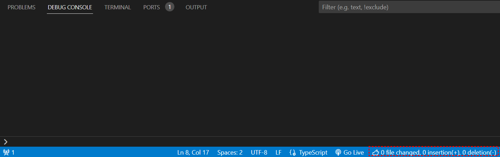

# Readability Checker Extension README

This extension checks the readability of your code base on `git diff`

## Features

- **insertionLimit**: (default 200) Threshold value for the number of insert lines to measure readability
- **deletionLimit**: (default 200) Threshold value for the number of delete lines to measure readability

## Requirements

- This extension requires Visual Studio Code 1.50 or later.
- This extension can run in workspace has `.git`.

## Extension Settings

This extension contributes the following settings:

- `readabilityChecker.insertionLimit`: control the insertionLimit
- `readabilityChecker.deletionLimit`: control the deleteionLimit

## Installation

You can install this extension from the Visual Studio Code marketplace.

## Contributing

If you have suggestions for how readability-checker could be improved, or want to report a bug, open an issue! We'd love all and any contributions.

For more information on how to contribute, please refer to our [CONTRIBUTING.md](CONTRIBUTING.md).

**Enjoy!**
